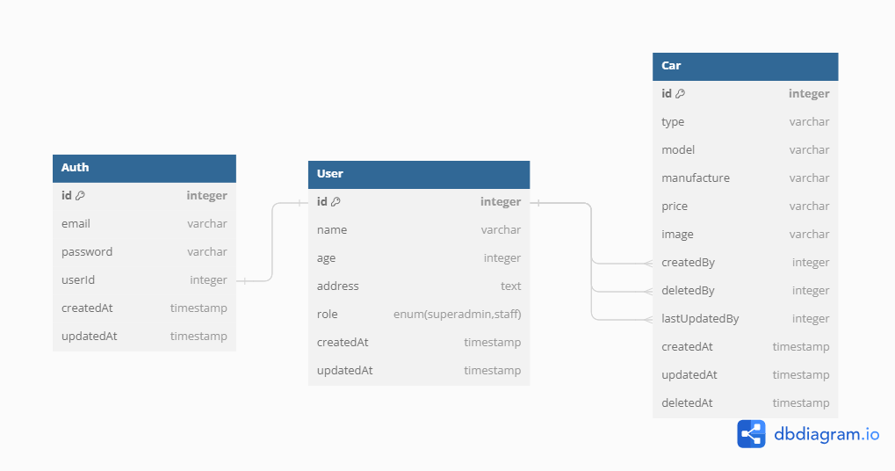
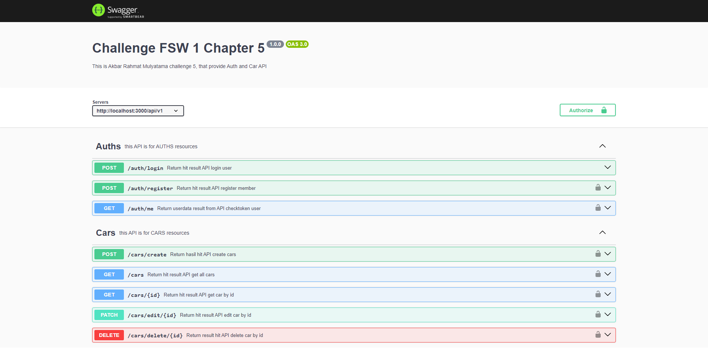

# Challenge 5 MSIB Binar Academy

## Database Structure

<hr>

<p align="center" width="100%">
     
</p>

## Installation

<hr>

- Clone This Repository
- `npm i`
- `npm run dev`

## Documentation

<hr>

#### Swagger Documentation

```http
  GET /api-docs
```

<p align="center" width="100%">
     
</p>

## API Reference

<hr>

## Auth Collection

#### Register

```http
  POST /api/v1/auth/register
```

#### Login

```http
  POST /api/v1/auth/login
```

#### Checktoken

```http
  GET /api/v1/auth/me
```

## Cars Collection

#### Get all cars

```http
  GET /api/v1/cars
```

#### Get car by id

```http
  GET /api/v1/cars/:id
```

#### Create car

```http
  POST /api/v1/cars/create
```

#### Update car

```http
  PATCH /api/v1/cars/edit/:id
```

#### Delete car

```http
  DELETE /api/v1/cars/delete/:id
```
